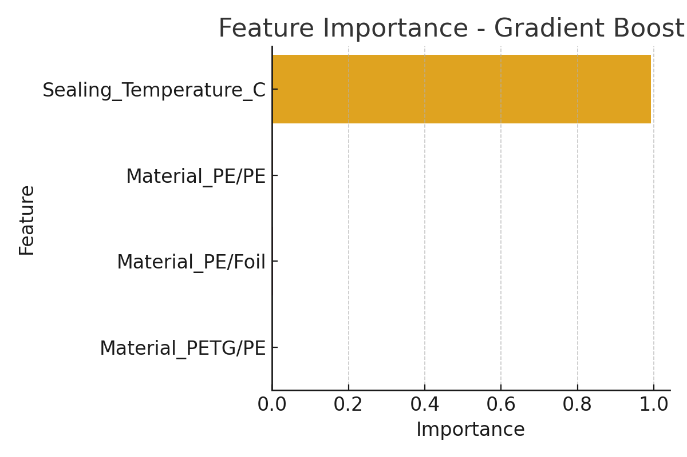
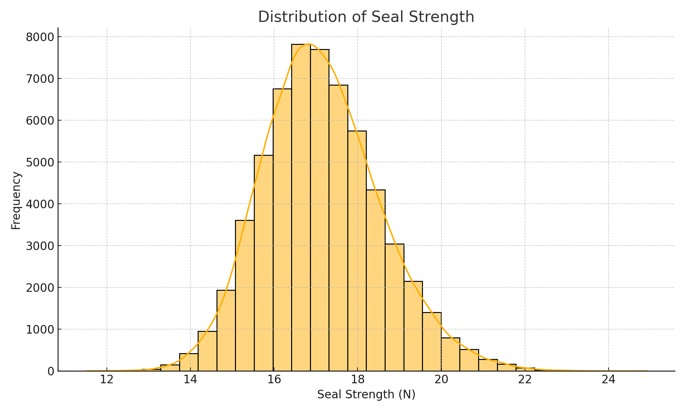
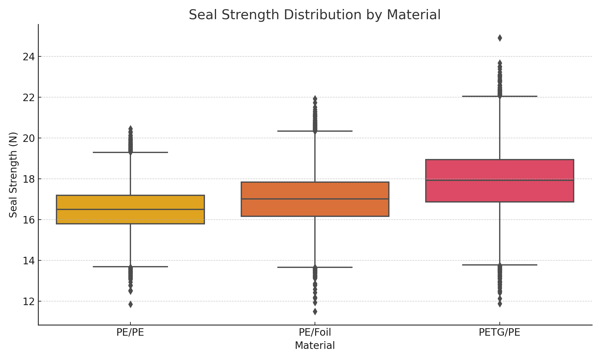

# Predicting Optimal Heat Seal Parameters Using Machine Learning

## 📌 Executive Summary
This project uses machine learning to predict optimal heat seal parameters—**temperature, pressure, and dwell time**—to achieve target seal strength for various packaging materials. Traditional Design of Experiments (DOE) is time-consuming and material-specific. By leveraging ML, manufacturers can **reduce trial-and-error, save resources, and accelerate packaging development**.

---

## 📊 Key Findings
- **Best Model:** Gradient Boosting Regressor  
- **RMSE:** 1.25  
- **R²:** 0.22  
- **Most Important Feature:** Sealing Temperature (~99% importance)

### 🔑 Feature Importance


---

## 📂 Dataset
The dataset consists of 60,000 experimental records with the following columns:
- `Material` – Packaging material type
- `Sealing_Temperature_C` – Temperature during sealing (°C)
- `Seal_Strength_N` – Measured seal strength (N)

---

## 📈 Visualizations
| Visualization | Description |
|--------------|-------------|
|  | Distribution of seal strength values |
|  | Relationship between temperature and seal strength by material |
|  | Comparison of seal strength distributions across materials |

---

## ⚙️ Methodology
1. **Data Preprocessing:** Normalization, one-hot encoding for material.
2. **Models Tested:** Linear Regression, Random Forest, Gradient Boosting.
3. **Hyperparameter Tuning:** GridSearchCV with 5-fold cross-validation.
4. **Evaluation Metrics:** RMSE and R² score.

---

## 📌 Results
| Model              | RMSE  | R²    |
|--------------------|-------|-------|
| Linear Regression  | 1.25  | 0.22  |
| Random Forest      | 1.34  | 0.10  |
| Gradient Boosting  | 1.25  | 0.22  |

---

## 🚀 Next Steps
- Collect more experimental data for better generalization.
- Add new features such as film thickness and humidity.
- Deploy as a **web dashboard** for engineers to input parameters and get predictions.

---

## 📂 Repository Structure
```
📦 HeatSealCapstone
 ┣ 📜 README.md
 ┣ 📜 HeatSealCapstone_Final_Notebook.ipynb
 ┣ 📜 HeatSealCapstone_Final_Report.docx
 ┣ 📊 seal_strength_distribution.png
 ┣ 📊 temp_vs_strength.png
 ┣ 📊 strength_by_material.png
 ┗ 📊 feature_importance.png
```

---

## 👤 Author
**Name:** Your Name  
**Email:** your.email@example.com  
**LinkedIn:** [LinkedIn Profile](https://linkedin.com/in/yourprofile)
